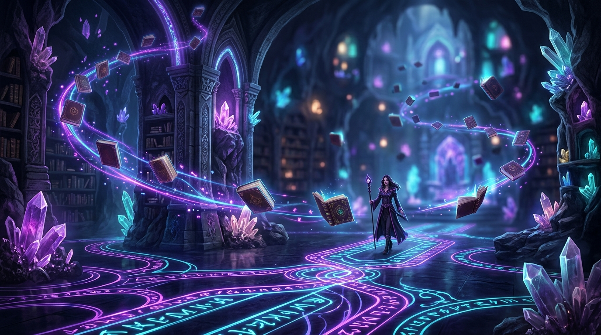

# ✨ Word Nexus (워드 넥서스)
> **Gemini AI 기반 수집형 행맨(Hangman) 단어 퍼즐 & 도감 수집 게임**



[](https://react.dev/)
[](https://www.typescriptlang.org/)
[](https://tailwindcss.com/)
[](https://ai.google.dev/)
[](https://firebase.google.com/)
[](https://vitejs.dev/)

---

## 🌟 개요 (Overview)

**Word Nexus**는 구글 **Gemini AI**와 **Firebase Firestore** 기술을 결합하여 제작된 고급 **AI 수집형 단어 퍼즐 게임**입니다. 
단순한 스펠링 맞추기 행맨 게임을 넘어, AI가 실시간으로 영단어와 독창적인 캐릭터 세계관(Lore), 일러스트, 등급을 생성하며, 플레이어는 맞춘 단어를 **소울 카드 캐릭터**로 포획하고 도감에 수집할 수 있습니다.

---

## 📱 주요 화면 및 UI 미리보기 (UI & Gameplay Showcase)

```
+-----------------------------------------------------------------------+
|  ✨ WORD NEXUS | 🏆 레벨 12 (EXP 68%) | 🪙 1,450 Gold | 📚 도감 48/120  |
+-----------------------------------------------------------------------+
|                                                                       |
|   +--------------------------+   +---------------------------------+  |
|   |  🌌 [Legendary] SHINY    |   |  🎯 GUESS THE WORD              |  |
|   |  "ASTRANOMOUS DRAGON"    |   |  Category: [생명체 / Rare]       |  |
|   |                          |   |  Hint: 'A stellar leviathan...' |  |
|   |  [ AI Character Art ]    |   |                                 |  |
|   |                          |   |  _  A  S  T  R  O  _  _  _  _   |  |
|   +--------------------------+   +---------------------------------+  |
|                                                                       |
|   +---------------------------------------------------------------+   |
|   |  ⌨️ LETTER KEYBOARD (HP: ♥♥♥♥♥♡)                               |   |
|   |  [A] [B] [C] [D] [E] [F] [G] [H] [I] [J] [K] [L] [M]          |   |
|   |  [N] [O] [P] [Q] [R] [S] [T] [U] [V] [W] [X] [Y] [Z]          |   |
|   +---------------------------------------------------------------+   |
+-----------------------------------------------------------------------+
```

### 🎮 핵심 게임 기능 (Key Features)

- 🤖 **Gemini AI 동적 콘텐츠 연성 Engine**:
  - 무한에 가까운 영단어 풀을 Gemini AI가 실시간 생성
  - 단어의 한글 뜻, 힌트, 카테고리(생명체, 유물, 현상, 공간, 추상 등), 텍스트 로어 및 1:1 일러스트 자동 합성
- 🃏 **도감 수집 & 샤이니(Shiny) 시스템**:
  - 6단계 캐릭터 희귀도: `Common` | `Uncommon` | `Rare` | `Unique` | `Epic` | `Legendary`
  - 5%의 확률로 등장하는 특별한 **Shiny (이로치)** 홀로그램 영웅 카드
  - 카드 중복 획득 시 캐릭터 레벨업 및 강화 효과
- ⚔️ **두 가지 독창적 게임 모드**:
  - 🌾 **파밍 모드 (Farming)**: 기회 제한 없이 느긋하게 단어를 추측하고 소울을 포획하는 수집용 모드
  - 🏆 **챌린지 모드 (Challenge)**: `Bronze`부터 `Nightmare`까지 6단계 난이도에 도전하는 랭킹 모드
- 📊 **실시간 리더보드 & Firestore 동기화**:
  - 유저 프로필(경험치, 레벨, 코인) 및 포획한 캐릭터 컬렉션 실시간 서버 저장
  - 전 세계 플레이어와 도감 수집 수 및 풀이 단어 수 실시간 순위 경쟁

---

## 🎨 희귀도 & 레어리티 가이드 (Rarity Tier System)

| 희귀도 (Rarity) | 등급 컬러 | 등장 확률 | AI 일러스트 특성 |
| :--- | :--- | :--- | :--- |
| **Common** | `Gray` | 45% | 표준적인 하급 소울 스피릿 |
| **Uncommon** | `Green` | 30% | 마법 자원을 품은 몬스터 및 유물 |
| **Rare** | `Blue` | 15% | 엘리트 등급의 가디언 및 비밀 공간 |
| **Unique** | `Purple` | 6% | 독특한 고대 아티팩트 및 정령 |
| **Epic** | `Yellow` | 3% | 우주적 환상체 및 에픽 신화 생물 |
| **Legendary**| `Red/Pink` | 1% | 네비아 세계관 최고위 신화/우주적 존재 |
| **✨ SHINY** | `Hologram` | 5% (추가) | 황금빛 아우라와 반짝이는 홀로그램 파티클 |

---

## 🏗️ 기술 스택 (Tech Stack)

### Frontend
- **Framework**: React 18 with Vite
- **Language**: TypeScript
- **Styling**: Tailwind CSS v4, Lucide React Icons
- **Animation & Effects**: Canvas Confetti, CSS 3D Hologram effects

### Backend & AI
- **Server**: Express.js (Node.js)
- **AI SDK**: `@google/genai` (Google Gemini 2.0 Flash / 3.0 Flash)
- **Image Processing**: Sharp (Buffer manipulation & caching)

### Database & Authentication
- **Database**: Firebase Firestore
- **Auth**: Firebase Anonymous Auth (No-friction auto login)

---

## 📂 프로젝트 구조 (Directory Structure)

```
word-nexus/
├── 📄 server.ts                  # Express 백엔드 API & Gemini AI 프록시 서버
├── 📄 index.html                 # 앱 진입점 HTML
├── 📄 package.json               # 프로젝트 의존성 및 스크립트 정의
├── 📄 metadata.json              # AI Studio 앱let 메타데이터
├── 📄 firestore.rules            # Firestore 보안 규칙
├── 📄 firebase-blueprint.json    # Firestore 데이터베이스 스키마 정의
└── 📁 src/
    ├── 📄 App.tsx                # 메인 애플리케이션 컴포넌트
    ├── 📄 main.tsx               # React DOM 엔트리
    ├── 📄 types.ts               # TypeScript 전역 인터페이스 정의
    ├── 📁 components/            # UI 컴포넌트
    │   ├── 📄 HangmanGame.tsx    # 행맨 퍼즐 & 캐릭터 카드 인터렉션
    │   ├── 📄 CollectionModal.tsx# 수집 도감 & 캐릭터 상세 모달
    │   ├── 📄 Leaderboard.tsx    # 실시간 유저 랭킹 모달
    │   └── 📄 ProfileBar.tsx     # 유저 레벨, 코인, 경험치 HUD
    ├── 📁 context/
    │   └── 📄 GameContext.tsx    # 전역 게임 상태 및 Firebase Firestore 연동
    ├── 📁 services/
    │   └── 📄 geminiService.ts   # 클라이언트 백엔드 API 서비스 호출부
    └── 📁 lib/
        ├── 📄 firebase.ts        # Firebase Firestore 및 Auth 초기화
        └── 📄 gameUtils.ts       # 단어 마스킹 및 확률 계산 유틸리티
```

---

## ⚙️ 실행 및 설치 방법 (Getting Started)

### 1. 레포지토리 클론 및 패키지 설치
```bash
# 의존성 패키지 설치
npm install
```

### 2. 환경 변수 설정 (.env)
프로젝트 루트 디렉토리에 `.env` 파일 또는 환경 변수를 설정합니다.
```env
# Google Gemini API Key (서버측 보안 처리)
GEMINI_API_KEY=your_gemini_api_key_here
```

### 3. 개발 서버 실행 (Express + Vite)
```bash
npm run dev
```
개발 서버가 `http://localhost:3000` 에서 시작됩니다.

### 4. 프로덕션 빌드 및 실행
```bash
# Vite & Server Bundling
npm run build

# 서버 실행
npm start
```

---

## 🔒 API Key & 보안 아키텍처

- **Gemini API Key 보호**: Gemini API 키는 클라이언트 브라우저에 절대 노출되지 않으며, `/api/generate-word` 및 `/api/generate-character-image` Express 백엔드 프록시 엔드포인트를 통해서만 안전하게 호출됩니다.
- **Firestore Security Rules**: 승인된 유저만 자신의 컬렉션을 업데이트할 수 있도록 `firestore.rules` 보안 규칙이 설정되어 있습니다.

---

## 📄 라이선스 (License)

This project is created for Google AI Studio Applet and is licensed under the MIT License.
